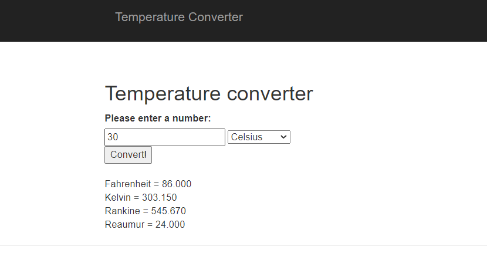

## Temperature converter Application With JavaScript, CSS & Bootstrap.

A JavaScript course assigment.

**Convert Temperatures from & to:**
* Celsius.
* Fahrenheit.
* Kelvin.
* Rankine.
* Reaumur.

